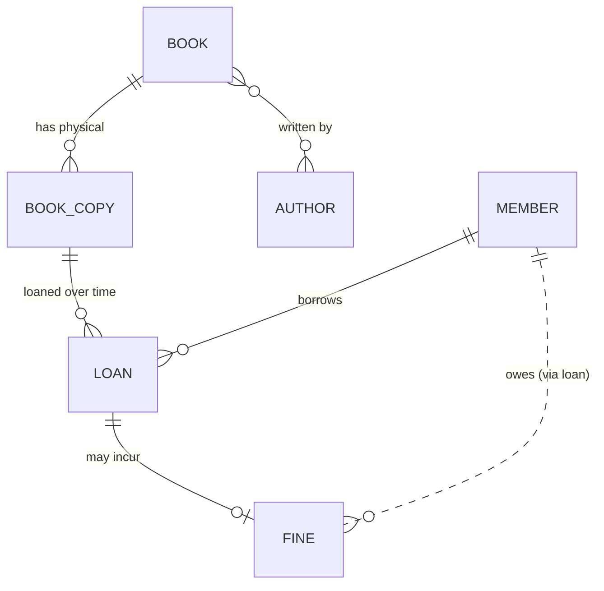

# Step 2 — The Conceptual (ER) Model

*Series: Designing the LMS Database · Chapter 2 of 12*

---

Step 1 gave us *what data exists* and *what questions we ask of it*. Step 2 draws the **shape**: which entities exist, how they relate, and — the part everyone rushes — the exact **cardinality** of each relationship. We do this with **no column types, no keys, no foreign-key syntax**. Those are physical concerns; getting them tangled up with the conceptual model is how people end up with a schema that encodes the wrong relationships under a veneer of correct-looking SQL.

> **The discipline of this step:** decide *one-to-many vs many-to-many* and *mandatory vs optional* for every relationship **before** you think about a single data type. The relationships are the skeleton; types are just skin.

---

## 2.1 The three levels of a data model — and where we are

Database design is traditionally done at three descending levels of abstraction. Knowing which one you're at stops you from arguing about `VARCHAR(255)` while the relationships are still wrong.

| Level | Answers | Contains | Audience |
|---|---|---|---|
| **Conceptual** (this step) | *What things exist and how do they relate?* | Entities + relationships + cardinality. **No** types, **no** keys. | Business + engineers |
| **Logical** (Step 3) | *What does each table look like, normalized?* | Tables, columns, PK/FK, normal forms — still engine-agnostic | Engineers |
| **Physical** (Step 10) | *How does it run on Postgres?* | `CREATE TABLE`, types, indexes, storage | DBAs / engineers |

We're at the top. The output is an **ER (Entity-Relationship) diagram** — the database cousin of the conceptual class map you sketched at the end of your LLD Step 3.

---

## 2.2 How to read a relationship: cardinality + optionality

Every line between two entities answers **two** independent questions. Beginners only ask the first.

1. **Cardinality — "how many?"** one-to-one (1:1), one-to-many (1:N), or many-to-many (M:N).
2. **Optionality — "is it mandatory?"** Must the other side exist (1) or can it be absent (0)?

In **crow's-foot notation** (what we'll use), the symbol nearest an entity reads toward it:

```
──||      exactly one        (mandatory, one)
──o|      zero or one        (optional, one)
──|<      one or many        (mandatory, many)
──o<      zero or many       (optional, many)
```

So "a Book has zero-or-many Copies, a Copy belongs to exactly one Book" is drawn `Book ||──o< BookCopy`. That single line carries a lot of design: it says a brand-new Book with no copies yet is *legal*, and a Copy with no Book is *illegal*. Both are real business decisions — we're making them on purpose, here, not by accident in a migration later.

---

## 2.3 Walking the LMS relationships

Let's take each pair from the Step-1 inventory and pin down both questions. The reasoning is the deliverable, not the picture.

### Book → BookCopy  `||──o<`  (one mandatory book, zero-or-many copies)

This is the keystone split from your LLD Step 1 (*Book ≠ BookCopy*), now expressed as a relationship.

- **A Copy must belong to exactly one Book.** A physical item with no catalog record is meaningless.
- **A Book may have zero copies** — the Admin can catalog a title before any physical copies arrive (and Rule #6's "lost/damaged" copies don't delete the Book). So the copy side is *zero*-or-many, not one-or-many. Naming this now prevents a future "why can't I add a book before its copies?" bug.

### Member → Loan  `||──o<`  (one mandatory member, zero-or-many loans)

- **A Loan must have exactly one borrowing Member** — a loan to nobody is nonsense.
- **A Member may have zero loans** (a freshly registered member). Over their lifetime they accumulate many.

### BookCopy → Loan  `||──o<`  — **the relationship people get wrong**

Here's the subtle one, and it's the best teaching moment in this step.

A copy gets loaned out, returned, loaned again, returned again — over its life it participates in **many** loans. So structurally it's **one copy → zero-or-many loans (historically)**.

The trap is to look at the rule *"a copy can only be on loan to one person at a time"* and model it as **1:1**. **That is wrong.** That rule is not a cardinality — it's an **invariant**: *at most one **active** loan per copy at any moment.* Historical loans for that copy still exist and must be queryable (AP-5, fines, history).

> **Teaching point — cardinality vs invariant.** Relationship cardinality describes what's *structurally possible over all time*; a business rule like "only one active loan" constrains *what's valid right now*. They are different layers. We model the structure as **1:N** here, and we'll enforce "one active loan per copy" as a **constraint** in Step 7 (a partial unique index), not by crippling the relationship to 1:1. Collapsing an invariant into cardinality throws away history — exactly the mistake `quantity: int` made in your LLD Step 1.

### Loan → Fine  `||──o|`  (one loan, zero-or-one fine)

- A Loan returned on time generates **no** fine → *zero*.
- A Loan returned late generates **one** fine (₹5/day × days late, Rule #3) → *one*.
- We're choosing **at most one fine per loan**, not many. (If the business later wanted "a daily fine row per overdue day," this would become 1:N — but that's not what the rules say, so YAGNI.)

### Member → Fine  (derived, via Loan — but we'll keep a direct link)

A Fine is owed *by* a Member, but it always arises *from* a Loan, and a Loan already knows its Member. So conceptually `Member → Fine` is **transitive** through Loan. We note it now and revisit in Step 3: AP-8 ("total outstanding for a member") may justify a *direct* `Member → Fine` link to avoid a three-table join. That's a logical/physical optimization — flagged here, decided later.

### Book ↔ Author  `>o──o<`  — **many-to-many**

Your LLD Step 3 modeled `authors` as a *list* on Book. In relational terms a repeating list is a **many-to-many**:

- A Book can have several Authors (co-authored works).
- An Author writes several Books.

M:N relationships **cannot be drawn directly in tables** — they require a junction (associative) entity. We acknowledge the M:N here conceptually; **resolving it into an `author` table + a `book_author` junction is a Step 3 job** (it's literally what normalization does to repeating groups).

> *Scale note:* `REQUIREMENTS.md` only ever says "author" (singular). A defensible KISS alternative at 500 books is a single `author` text column on Book and no Author entity at all. I'm keeping Author as a first-class M:N because your LLD already modeled authors as a collection — but this is a real fork worth a sentence in the doc, not a silent assumption.

### Book ↔ Genre/Category

Same question, lighter stakes. A book usually has one genre but realistically can have several ("Sci-Fi" + "Young Adult"). We'll start with **genre as a simple attribute on Book** (KISS — the requirements only mention filtering by genre, AP-1) and note that promoting it to an M:N `category` entity is a one-migration change if multi-category search is ever needed.

### The actors: Member, Librarian, Admin

From your LLD Step 3, **Librarian and Admin are roles/actors, not domain entities** (until auth is added). The same holds in the data model: they don't get tables yet. Only **Member** is a stored entity, because we persist member records. Librarian/Admin are *who performs* an access pattern, not *data we store*.

---

## 2.4 The ER diagram

Putting every decision together. First in Mermaid (renders on GitHub), then the same thing in ASCII for the terminal.



```text
                    ┌──────────┐
                    │  AUTHOR  │
                    └────┬─────┘
                         │ M:N  (resolved into a junction in Step 3)
                         │
   ┌──────────┐    ║     ▼
   │   BOOK   │════╩═══ written by
   └────┬─────┘
        │ 1 : N   (a Book has zero-or-many Copies; a Copy has exactly one Book)
        ▼
   ┌──────────┐
   │ BOOK_COPY│
   └────┬─────┘
        │ 1 : N   (historically many loans per copy;
        │          "one ACTIVE loan" is an invariant, not cardinality → Step 7)
        ▼
   ┌──────────┐        1 : N        ┌──────────┐
   │   LOAN   │◀────────────────────│  MEMBER  │   (a Member borrows zero-or-many Loans)
   └────┬─────┘                     └────┬─────┘
        │ 1 : 0..1                       ┊
        ▼                                ┊ owes (transitive via Loan;
   ┌──────────┐                          ┊  direct link decided in Step 3)
   │   FINE   │◀┄┄┄┄┄┄┄┄┄┄┄┄┄┄┄┄┄┄┄┄┄┄┄┄┄┘
   └──────────┘
```

---

## What we produced in Step 2

- An **ER diagram** with every relationship's cardinality *and* optionality decided on purpose.
- Five core relationships nailed down: Book→Copy (1:N), Member→Loan (1:N), Copy→Loan (1:N **historical**), Loan→Fine (1:0..1), Book↔Author (M:N, to be resolved next).
- The chapter's keystone: **"one active loan per copy" is an invariant, not a 1:1 relationship** — modeled as 1:N now, enforced as a constraint in Step 7.
- Three explicit scale forks left as one-liners (Author as M:N vs text column; Genre as attribute vs entity; direct Member→Fine link), so they're conscious decisions, not accidents.

## Key takeaways (transferable)

1. **Cardinality + optionality are two separate questions.** "How many?" *and* "is it mandatory?" Every relationship line answers both.
2. **Don't confuse an invariant with cardinality.** "Only one active X" is a constraint over *current* state; the structural relationship is usually still 1:N. Collapsing it to 1:1 destroys history.
3. **Many-to-many is a signal, not a final answer** — it always becomes a junction table in the logical model (Step 3).
4. **Actors aren't entities.** If you only *use* the system in that role and store no data for it, it's not a table (yet).
5. **Decide at the right level.** Settle relationships before types; flag physical optimizations (direct links, denormalization) but don't make them here.

## Principles in play

| Principle | How this step applied it |
|---|---|
| **Abstraction levels** | Held the line at the conceptual level — relationships before types or keys. |
| **Invariant vs structure** | Separated "one active loan" (rule, Step 7) from "copy has many loans" (structure, now). |
| **YAGNI / KISS** | Genre as an attribute, single bounded set of entities — refused entities the requirements don't demand. |
| **Single Source of Truth** (carried from Step 1) | Member→Fine kept transitive-by-default; a redundant direct link must *justify itself* in Step 3. |

---

*Next — Step 3: Logical model & normalization. We turn these entities into actual tables with columns, drive them through 1NF→2NF→3NF, and resolve the Book↔Author many-to-many into an `author` table plus a `book_author` junction. This is where the ER diagram becomes a real (still engine-agnostic) schema.*
